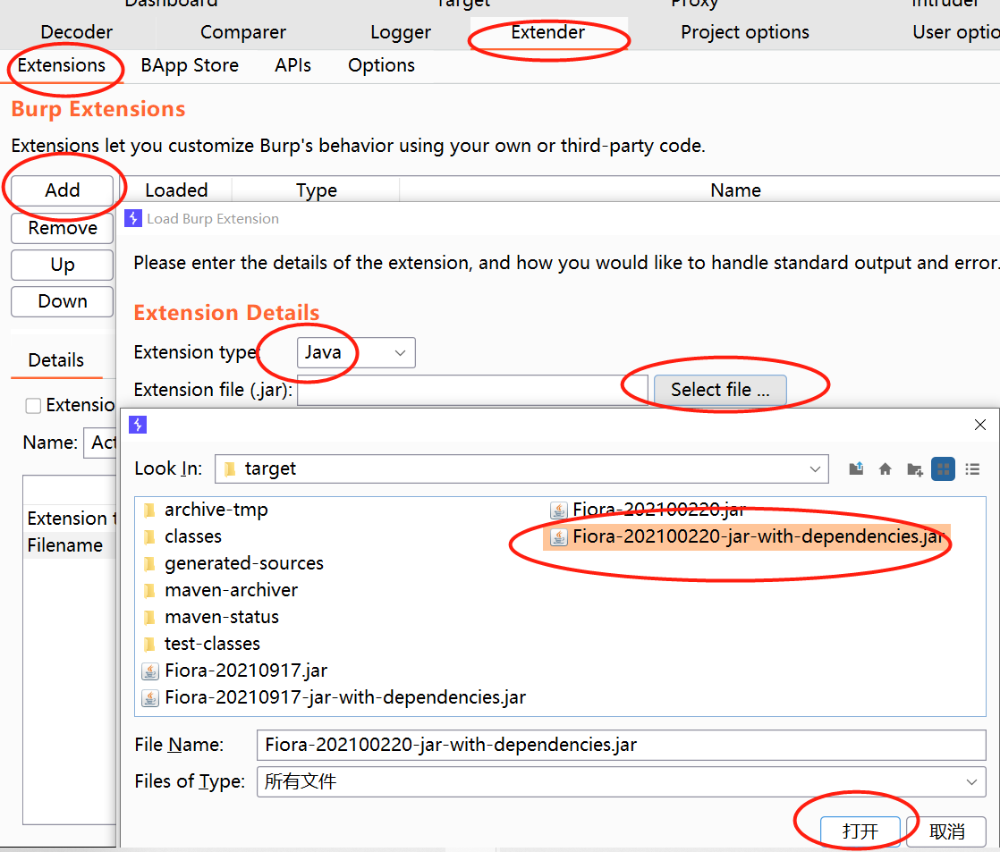
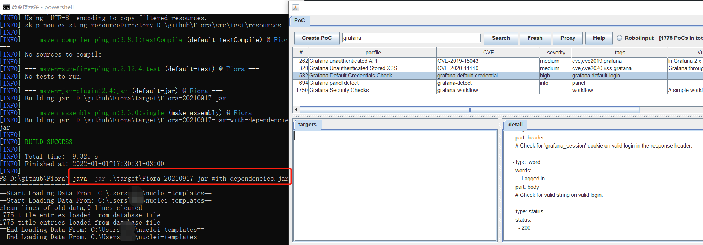
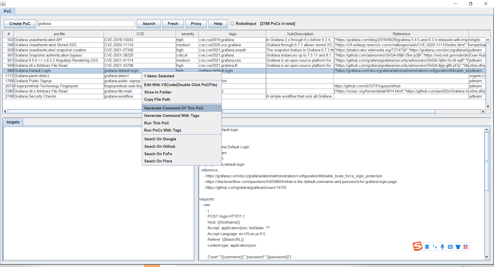
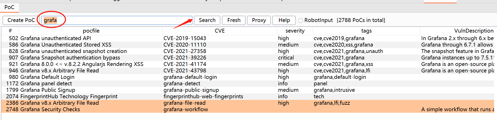
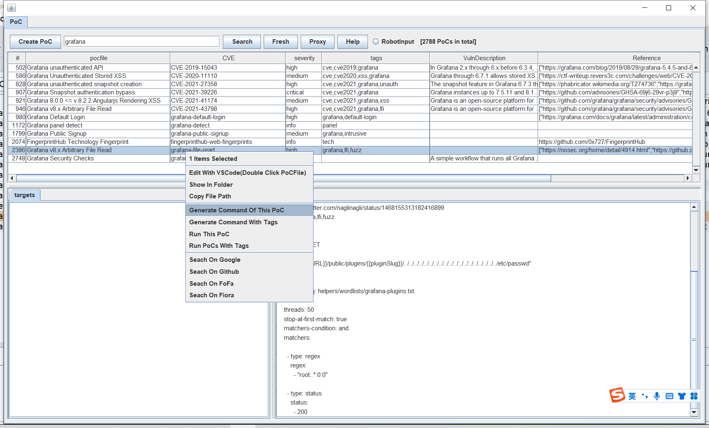
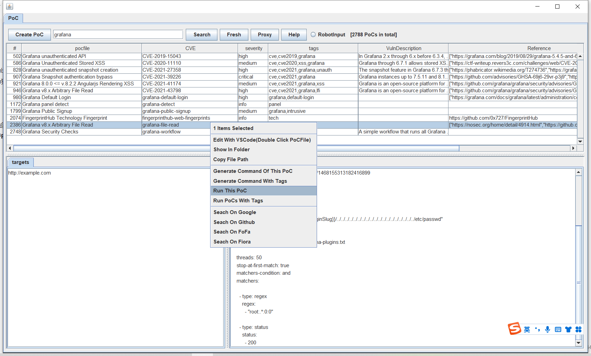

## Fiora

项目简介：Fiora是LoL中的无双剑姬的名字，她善于发现对手防守弱点，实现精准打击。该项目为PoC框架[nuclei](https://github.com/projectdiscovery/nuclei)提供图形界面，实现快速搜索、一键运行等功能，提升[nuclei](https://github.com/projectdiscovery/nuclei)的使用体验。

项目地址：https://github.com/bit4woo/Fiora

项目作者：[bit4woo](https://github.com/bit4woo)

视频教程：https://www.bilibili.com/video/bv1Ha411z7T1

## 安装运行

### 一、作为burp插件运行

1、访问https://github.com/bit4woo/Fiora/releases

2、下载最新jar包

3、如下方法安装插件




### 二、作为独立程序运行

该程序即可作为burp插件运行，也可以作为独立程序运行。命令行下通过java启动程序的命令：

```
java -jar Fiora-202100220-jar-with-dependencies.jar      
```



程序截图



### 三、最新源码尝鲜

#### 自行打包

当你遇到bug或者想使用最新的功能时，可以使用如下方法自行打包。

```
git clone https://github.com/bit4woo/Fiora
cd Fiora
mvn package
```

#### 关于"burp-api-common"下载失败

如果没有使用过GitHub Packages，则需要创建或修改/Users/xxxxxx/.m2/setttings.xml 文件

https://github.com/settings/tokens

```
<settings xmlns="http://maven.apache.org/SETTINGS/1.0.0"
  xmlns:xsi="http://www.w3.org/2001/XMLSchema-instance"
  xsi:schemaLocation="http://maven.apache.org/SETTINGS/1.0.0
                      http://maven.apache.org/xsd/settings-1.0.0.xsd">

  <activeProfiles>
    <activeProfile>github</activeProfile>
  </activeProfiles>

  <profiles>
    <profile>
      <id>github</id>
      <repositories>
        <repository>
          <id>central</id>
          <url>https://repo1.maven.org/maven2</url>
        </repository>
        <repository>
          <id>github</id>
          <url>https://maven.pkg.github.com/bit4woo/*</url>
          <snapshots>
            <enabled>true</enabled>
          </snapshots>
        </repository>
      </repositories>
    </profile>
  </profiles>

  <servers>
    <server>
      <id>github</id>
      <username>你的GitHub用户名</username>
      <password>你的GitHub access token 通过https://github.com/settings/tokens获取</password>
    </server>
  </servers>

    <properties>  
        <project.build.sourceEncoding>UTF-8</project.build.sourceEncoding>  
        <maven.compiler.encoding>UTF-8</maven.compiler.encoding>  
    </properties> 
</settings>
```

`</repository>` 和`<server>` 中的内容是你需要配置的。` <repository>`中的内容你可以直接复制粘贴。

```
       <repository>
          <id>github</id>
          <url>https://maven.pkg.github.com/bit4woo/*</url>
          <snapshots>
            <enabled>true</enabled>
          </snapshots>
        </repository>
```

而`<server>` 中的内容就必须用自己的了。通过https://github.com/settings/tokens获取你的GitHub access token

```
    <server>
      <id>github</id>
      <username>你的GitHub用户名</username>
      <password>你的GitHub access token 通过https://github.com/settings/tokens获取</password>
    </server>
```

完成后再进行步骤一的操作即可。

## 注意说明

1、你需要自行安装nuclei到本地环境，并且将命令加入环境变量。安装方法可以参考[官方文档](https://nuclei.projectdiscovery.io/nuclei/get-started/#running-nuclei)。

2、nuclei的模板文件存放的默认路径是当前用户路径下，即 YourUserHome/nuclei-templates。


## 使用方法

以grafana的PoC为例。

### 搜索PoC

程序会自动扫描nuclei-templates目录下的所有PoC文件，并加载进程序中，可以通过关键词搜索来找到想要的PoC。



### 生成PoC命令

选中想要的PoC，右键选择“generate Command Of This PoC”即可。命令会写入剪切板，直接粘贴运行即可。优点是可以对命令行进行再次编辑，但是需要自行粘贴后运行。



```
#生产的单个PoC 
nuclei -t C:\Users\P52\nuclei-templates\vulnerabilities\grafana\grafana-file-read.yaml -u http://example.com -proxy http://127.0.0.1

#生产workflow PoC
nuclei -w C:\Users\P52\nuclei-templates\workflows\grafana-workflow.yaml -u http://example.com -proxy http://127.0.0.1


nuclei -tags grafana -u http://example.com -proxy http://127.0.0.1
```

### 直接执行PoC

和生成PoC命令类似，但是它会直接执行生成的命令，不需要粘贴。优点是更便捷，但是无法编辑命令行。



### 关于RobotInput

RobotInput选项会影响命令执行的方式。

**当启用RobotInput时**，会尝试先开启一个命令行终端，然后以模拟键盘输入的方式进行命令的执行。优点是：效果类似人为交互，会在命令行终端留下历史记录。缺点是：这个方式受程序响应速度、剪切板读写是否成功的影响，不是很稳定，某些情况会出现混乱错误。

**当停用RobotInput时**，会将所有命令先写入bat文件，然后运行bat文件，来实现系统命令的执行。优缺点刚好相反：功能稳定，但是不会留下命令行历史记录。
